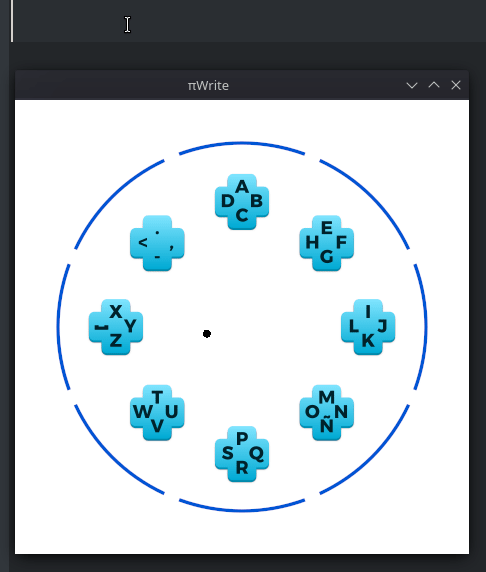

# πWrite 
A joystick input method made with Rust

# Building
Requirements:  
- Rust

Run ´cargo build´ in the repo root.

# Using
This program uses a joystick. Move the right stick to select a set of letters, then press up, down, right or left depending on the letter position in the cross.  
- RB/R1: Backspace
- LB/L1: Space
- LT/L2: Shift
